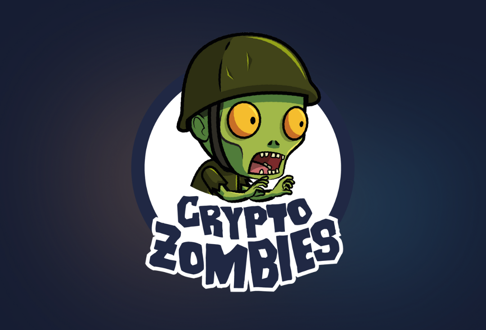

<a name="readme-top"></a>
[](https://github.com/julienbrs)
[![LinkedIn][linkedin-shield]][linkedin-url]

<!-- PROJECT LOGO -->
<br />
<div align="center">
  <a href="https://github.com/julienbrs/CryptoZombies">
    
  </a>

<h3 align="center">CryptoZombies Course</h3> 
  </p>
</div>

<!-- TABLE OF CONTENTS -->
<summary>Table of Contents</summary>
<ol>
  <li>
    <a href="#about-the-project">About The Course</a>
    <ul>
      <li><a href="#course-structure">Course Structure</a></li>
      <li><a href="#getting-started">Getting Started</a></li>
    </ul>
  </li>
  <li>
    <a href="#topics-covered">Topics Covered</a>
  </li>
  <li><a href="#contact">Contact</a></li>
</ol>

<br />

<!-- ABOUT THE PROJECT -->

## About The Course


This repository contains code that I wrote while following the Cryptozombie course (https://cryptozombies.io/), an online course that teaches people how to build decentralized applications (DApps) on the Ethereum blockchain.

I highly recommend the Cryptozombie course to anyone interested in learning about blockchain technology and Solidity programming. The interactive lessons and gamification make the learning experience fun and engaging, and I feel that the course has greatly improved my skills in this field. Thank you to the Cryptozombie team for creating such a valuable resource!

### Course Structure

The repository is organized into directories corresponding to each lesson in the course. Each directory contains the code that I wrote for that lesson, including Solidity smart contracts (.sol files) and scripts for testing and interacting with the contracts (e.g. test.js and deploy.js).

Please note that this repository does not contain all the dependencies required to run the code. In order to run the code, you will need to install the required dependencies and set up a local Ethereum blockchain, such as Ganache.

### Getting Started

To run the code in this repository, you will first need to install the required dependencies using npm:

```sh
npm install
```

You will also need to have a local Ethereum blockchain running, such as Ganache.

Once the dependencies are installed and the blockchain is running, you can compile and deploy the smart contracts using Truffle:

```sh
truffle compile
truffle migrate
```

Finally, you can start the development server to interact with the DApp:

```sh
npm run start
```

This will launch the DApp in your web browser.

<p align="right">(<a href="#readme-top">back to top</a>)</p>

<br />

## Topics Covered

<p>
    <b> Introduction to the Ethereum blockchain and smart contracts:</b><br/>
        <ul>
            <li> Overview of the Ethereum blockchain and how it works
            <li> Introduction to smart contracts and their role in building DApps
            <li> Key features and benefits of the Ethereum blockchain
        </ul>
    <b> Solidity programming language and syntax:</b><br/>
        <ul>
            <li> Basics of the Solidity programming language
            <li> Syntax and data types used in Solidity
            <li> Defining functions and variables in Solidity
        </ul>
    <b> Deploying and interacting with smart contracts on the Ethereum network:</b><br/>
        <ul>
            <li> Deploying smart contracts using Truffle and Ganache
            <li> Interacting with deployed contracts using web3.js
        </ul>
    <b> Using web3.js to connect DApps to the Ethereum blockchain:</b><br/>
        <ul>
            <li>Querying the blockchain and listening for events with web3.js
            <li> Executing transactions on the Ethereum network using web3.js
        </ul>
    <b> Debugging and testing smart contracts:</b><br/>
        <ul>
            <li>Debugging and testing smart contracts to ensure they are working as intended
            <li> Common pitfalls and best practices for testing smart contracts
            <li> Using Remix and Truffle to catch and fix errors
        </ul>

</p>

<p align="right">(<a href="#readme-top">back to top</a>)</p>

<br />

<!-- CONTACT -->

## Contact

Bourseau Julien - _2nd year student at Ensimag_ - julien.bourseau@gmail.com

Project Link: [https://github.com/julienbrs/CryptoZombies](https://github.com/julienbrs/CryptoZombies)

<p align="right">(<a href="#readme-top">back to top</a>)</p>

[linkedin-shield]: https://img.shields.io/badge/-LinkedIn-black.svg?style=for-the-badge&logo=linkedin&colorB=555
[linkedin-url]: https://www.linkedin.com/in/julien-bourseau-ba2239228
